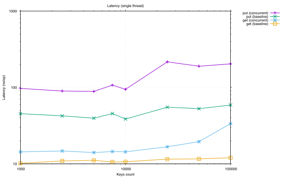
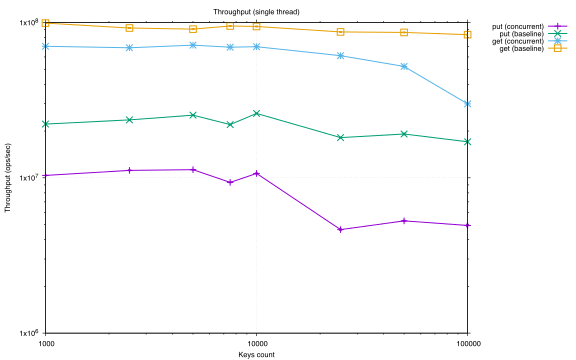
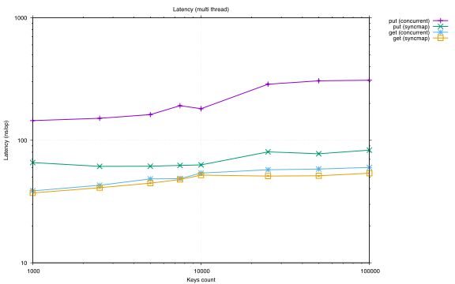
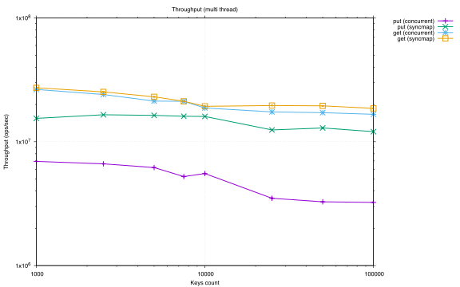
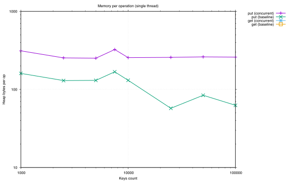
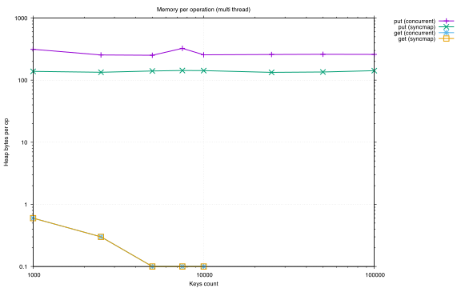
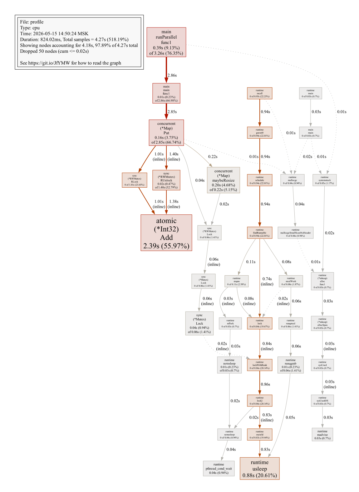
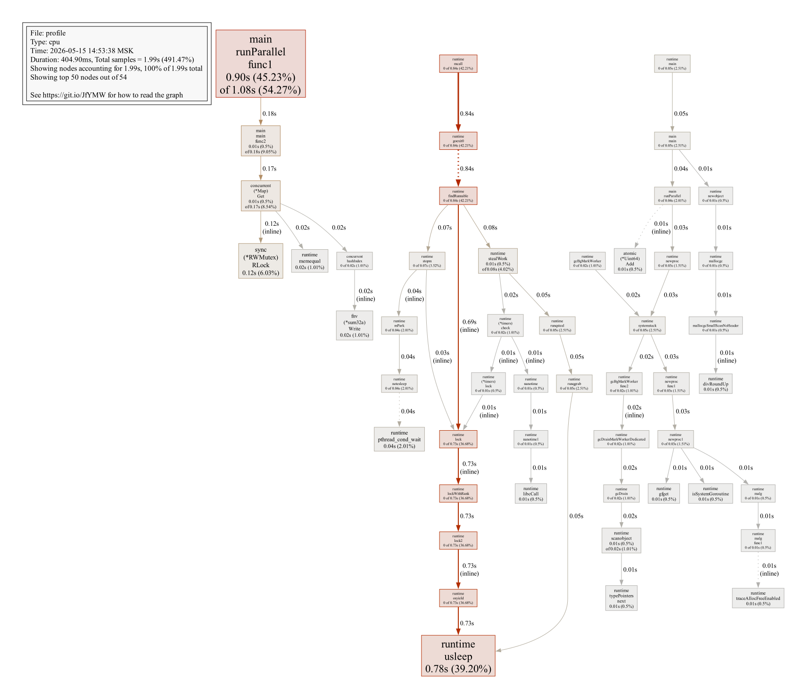

# Concurrent hash map

A hash table that several goroutines can hit at once, built on striped locking, and measured
honestly against the two things anyone would otherwise reach for.

## Implementation

Each bucket carries its own `sync.RWMutex`, so writers to different buckets never meet, and
the table itself sits behind an `atomic.Value` so readers reach it without a lock. Hashing is
FNV-1a. The table doubles and rehashes once the load factor passes its threshold.

## Single thread

Against the built-in map, the cost of synchronisation is paid without any of the benefit.

 

*Latency and throughput on one goroutine.*

`put` runs two to four times slower than `map[string]string`, `get` between 1.4 and 2.8
times slower.

## Several threads

 

*The same measurements under concurrent load.*

Here `sync.Map` takes `put` by a factor of two to four, while `get` comes out comparable, the
implementation trailing by ten to fifteen per cent.

## Memory

 

*Bytes per operation.*

Memory per `put` holds around 250 to 324 bytes, about twice what the standard maps use. The
overhead is accounted for exactly: 24 bytes for the mutex in every bucket, 32 for the two
string headers in an entry, and the reallocations as a bucket's slice grows. The spike at
7500 keys is the resize itself, the bucket count doubling from 16 to 32 with a full rehash.

## Where the time goes

 

*CPU profile call graphs for `put` and `get` at 50 000 keys.*

The profile confirms the arithmetic rather than surprising it: mutex acquisition, the FNV-1a
hash and `memequal` comparing string keys inside a bucket account for the time, plus
`maybeResize` on the write path.

## What it comes to

The bottleneck is the global `resizeMu` held during a resize, which stops every `Put` in the
table. Lock striping with hand-off, or a lock-free resize, is what the next version would
need. As it stands the structure is a demonstration of the technique, not a replacement for
`sync.Map`.
