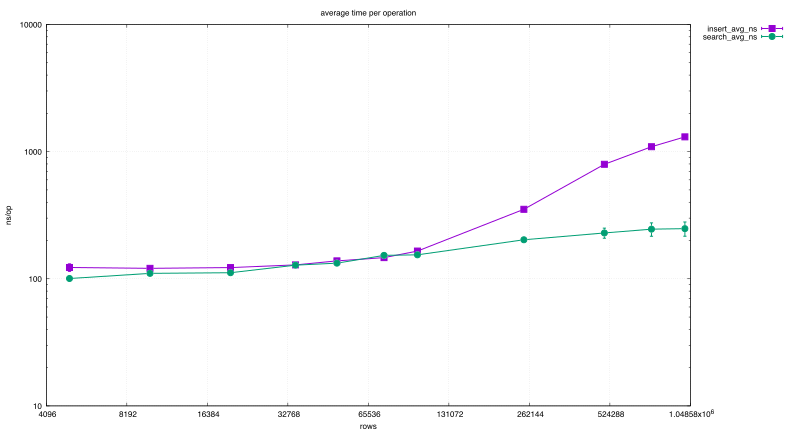
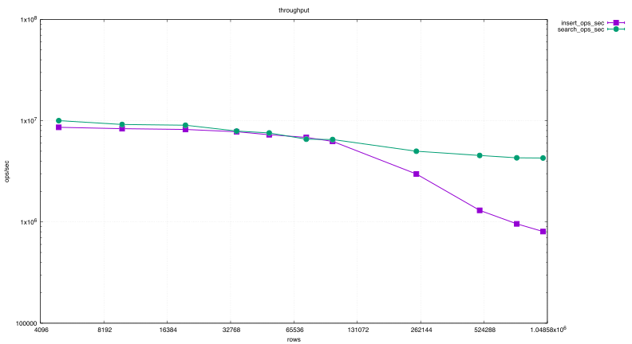

# Geosearch on a kd-tree

A kd-tree over geographic points in C, built from a CSV, supporting dynamic insertion and
nearest-neighbour search, with a benchmark that reports confidence intervals rather than
single runs.

## Method

Data sets from 5 000 to 1 000 000 points. Each operation is repeated over many rounds, and
the benchmark computes 95 per cent confidence intervals for both the time per operation and
the throughput, so that the difference between two sizes can be told from noise.

## Results

| Points | Insert, M op/s | Search, M op/s |
|-------:|---------------:|---------------:|
| 5 000 | 8.61 ± 0.28 | 10.02 ± 0.14 |
| 50 000 | 7.28 ± 0.10 | 7.58 ± 0.09 |
| 100 000 | 6.26 ± 0.18 | 6.52 ± 0.09 |
| 250 000 | 2.98 ± 0.12 | 5.00 ± 0.08 |
| 500 000 | 1.30 ± 0.05 | 4.54 ± 0.08 |
| 1 000 000 | 0.80 ± 0.04 | 4.28 ± 0.08 |

 

*Average latency and throughput against the number of points.*

## What the numbers say

At small and medium sizes insertion and search cost about the same. As the tree grows they
part company: search falls off gently, from 10 to 4.3 million operations per second across
two orders of magnitude, while insertion collapses by a factor of ten. The tree is never
rebalanced, so every insertion walks a deeper and more lopsided path, and it is the write
side, not the read side, that a balancing strategy would have to fix.

## Profiles

Flame graphs of the search path at 100 000, 500 000 and 1 000 000 points are in
[`profiles/`](profiles).
