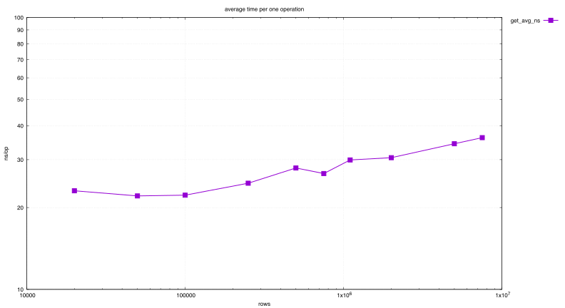
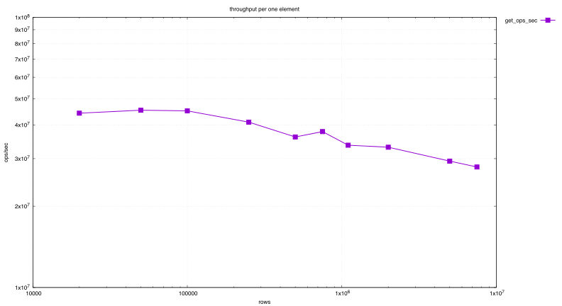
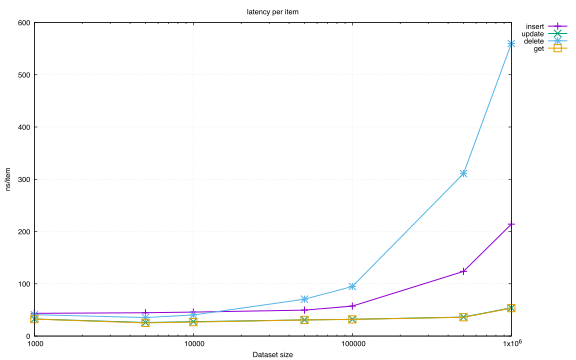
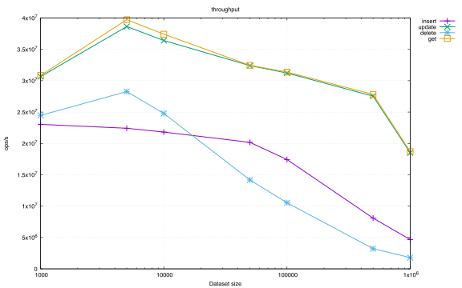
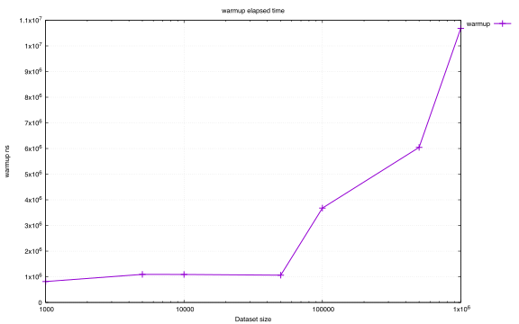
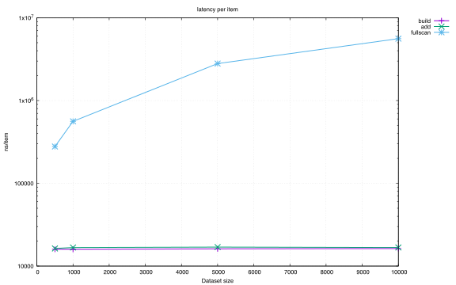
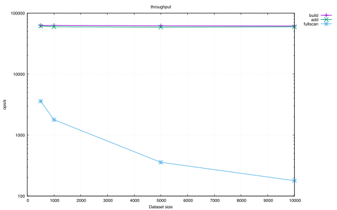
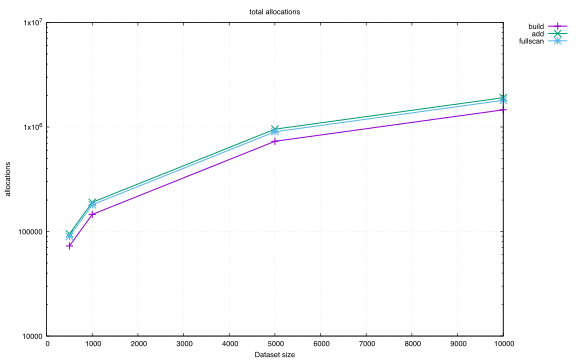
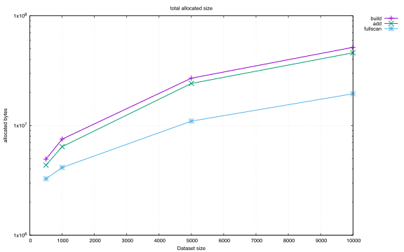

# Three hash structures

Perfect hashing, extendible hashing and MinHash LSH, each written for the case it belongs
to, each measured on data sets of growing size.

## Perfect hashing

A table built once over a fixed set of string keys, where the hash function is chosen so
that no two keys collide, so a lookup is one probe and nothing else. This is the static
scenario: build from CSV, then read.

 

*Latency and throughput of `get`.*

Lookup latency stays low and throughput stays high across the whole range of sizes, which is
the property the structure is chosen for.

## Extendible hashing

A table that lives in a file through `mmap` and grows by doubling a directory of pointers to
buckets, so that only the bucket that overflowed is ever split. Insert, read, update and
delete are all supported.

 

*Latency and throughput by operation.*

*Warm-up time.*

`get` and `update` are the fastest, since neither touches the directory. `insert` pays for
the occasional split, and `delete` pays the most, because it has to modify both the bucket
and the directory that points at it.

## MinHash LSH

An index for finding near-duplicate texts, where each document is reduced to a signature of
minimum hash values and similar signatures land in the same bucket. The baseline it is
measured against is the honest one: comparing every document with every other.

 

*Latency and throughput of `build`, `add` and `fullscan`.*

 

*Allocation count and size from the memory profile.*

`build` and `add` scale linearly at roughly 15 000 nanoseconds per element, while the full
scan grows quadratically, which is the whole argument for the index in one picture.
