# Inverted index

A search index built from scratch, from the postings on disk up to a ranked query language,
and measured on collections from 500 to 200 000 documents.

## What it does

Queries support `AND`, `OR`, `NOT`, `ADJ` for adjacent terms and `NEAR/k` for terms within a
distance, with results ranked by BM25. A parser turns the query into an AST and an evaluator
walks it over the postings. There is a TUI for driving it by hand.

## How it stores things

Posting lists are delta-coded and bitpacked into a binary format on disk, with skip lists so
that an intersection can jump over blocks instead of scanning them. The file is opened
through `mmap` and decoded lazily, so a query touches only the postings it needs.

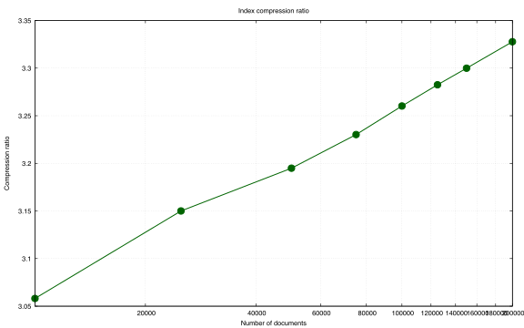 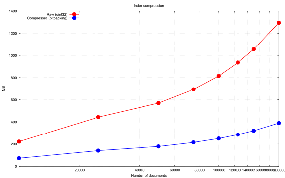

*What delta coding and bitpacking take off the postings.*

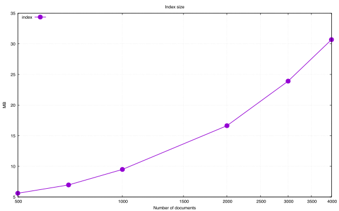 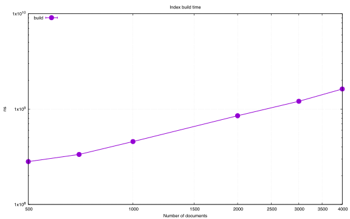

*Index size and build time against the number of documents, both linear.*

## Search

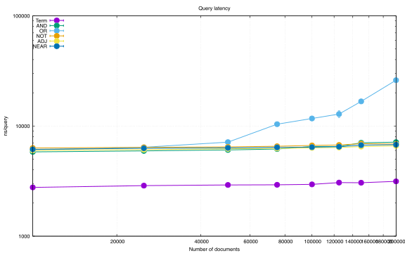 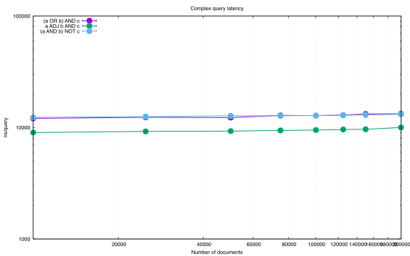

*Latency by operator, simple and complex queries.*

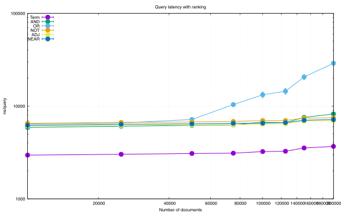 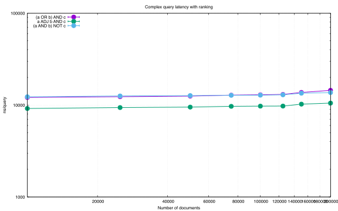

*The same queries with BM25 ranking applied.*

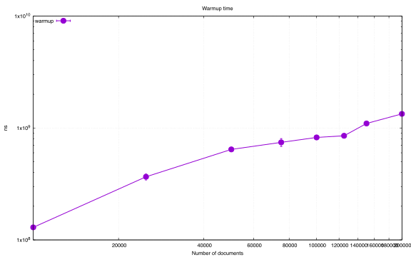

*The first query against the repeats.*

`Term` is the fastest operator and `Or` the slowest, which follows from the work each does:
a term lookup reads one list, while a union has to merge several and cannot skip. Warm-up
costs far more than any later search, since the first query is what faults the mapped pages
in.

## Profiles

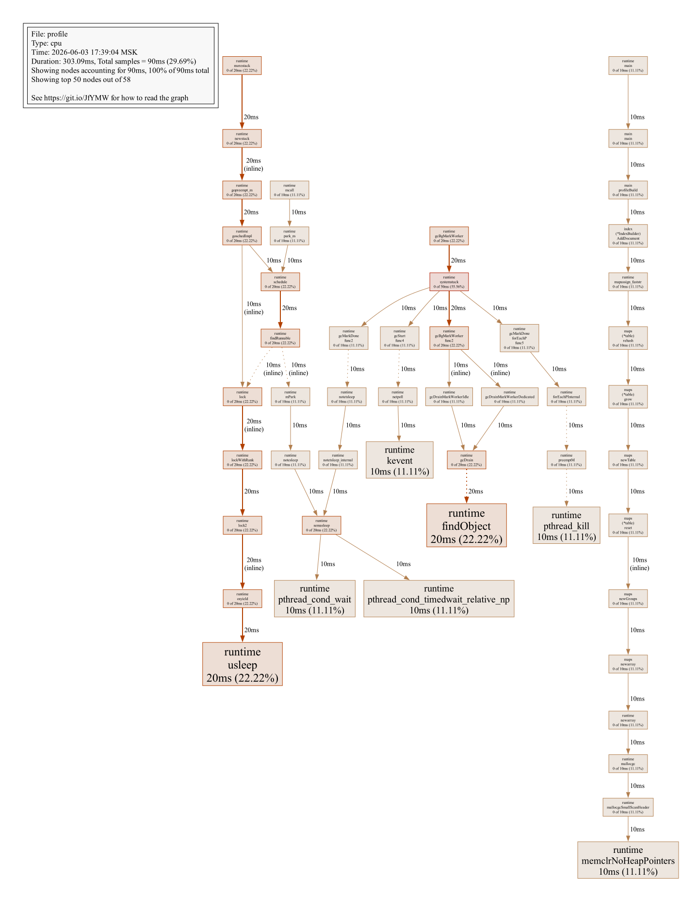 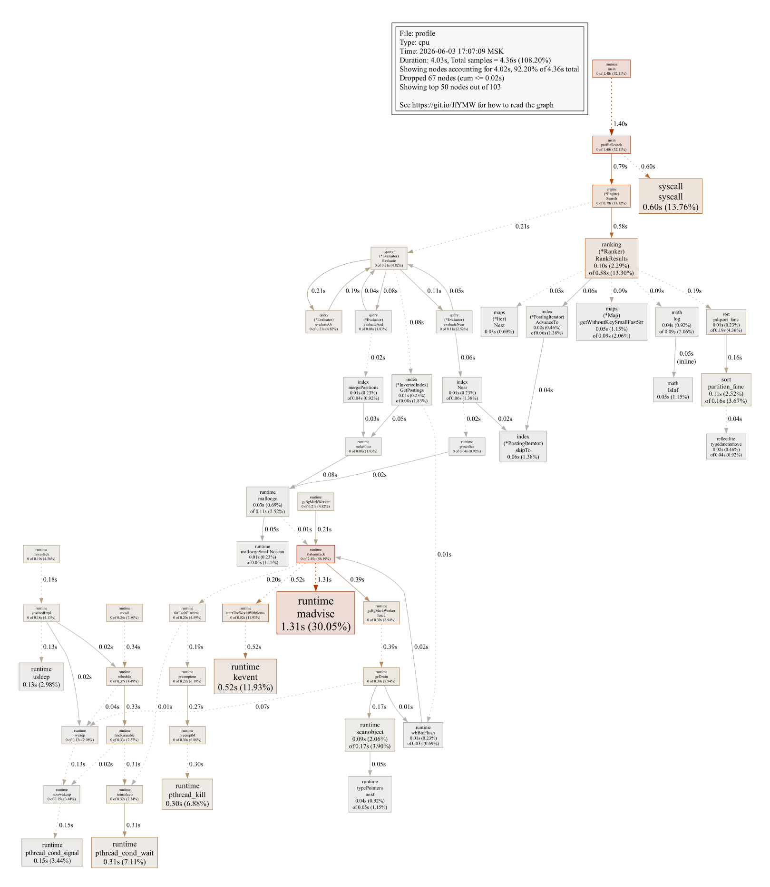

*CPU profiles of building and searching.*
