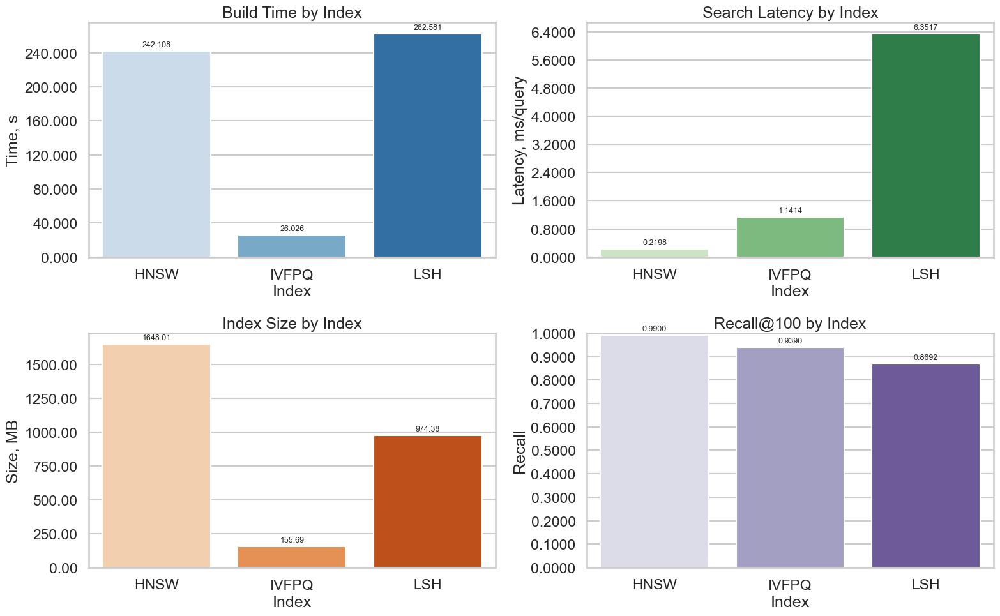

# Approximate nearest neighbours

Searching a million word vectors for the closest matches, where the exact answer is too
expensive and the question becomes how much recall each approximation gives back per second
and per gigabyte.

## Setup

One million 300-dimensional fastText vectors from Common Crawl, 10 000 queries, and the
true top-100 neighbours computed by brute force as ground truth. Three Faiss index families
are compared, each over a grid of its own parameters: LSH by the number of bits, HNSW by the
graph degree and the construction and search effort, and IVF+PQ by the number of lists,
probes and quantiser settings.

## Results

The best configuration of each family, at recall@100.

| Index | Parameters | Recall | Build, s | Query, ms | Size, MB |
|-------|------------|-------:|---------:|----------:|---------:|
| HNSW | M=64, efConstruction=256, efSearch=256 | 0.990 | 242 | 0.22 | 1648 |
| IVF+PQ | nlist=4096, nprobe=512, m=150 | 0.939 | 26 | 1.14 | 156 |
| LSH | nbits=8096 | 0.869 | 263 | 6.35 | 974 |

*Recall, build time, query time and index size across the parameter grids.*

## What the numbers say

The three families are not really competing on the same axis, they are trading different
resources. HNSW buys the highest recall and the fastest queries with memory, holding a graph
of 1.6 GB over vectors that are themselves about 1.1 GB. IVF+PQ gives up five points of
recall and gets an index ten times smaller, because product quantisation stores compressed
codes rather than the vectors, and it builds in a tenth of the time. LSH is beaten on every
axis here: lowest recall, slowest queries and an index no smaller than the graph.

Inside HNSW the grid behaves as the algorithm promises. Recall rises with `efSearch`, and
raising `efConstruction` buys recall at build time rather than at query time, which is the
right trade for an index built once and queried often.
